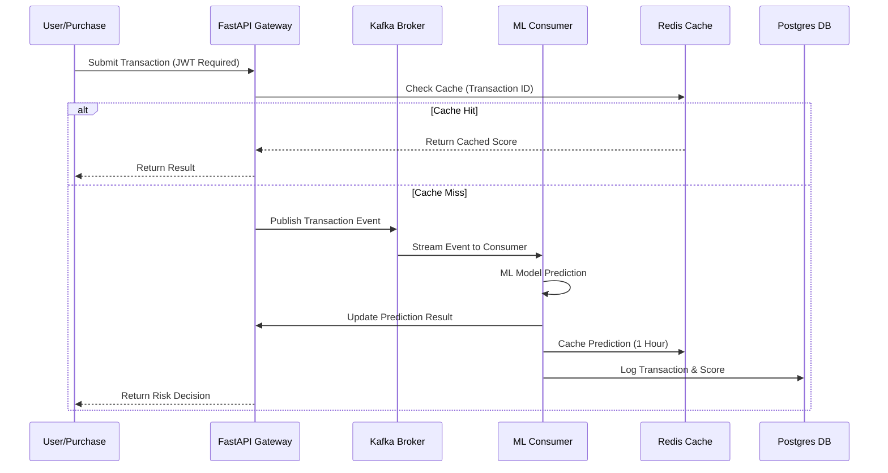

# Fraud Detection System

A high-performance, real-time transaction monitoring and fraud prevention platform leveraging Machine Learning, event streaming, and in-memory caching.

## Project Overview

This system is engineered to detect fraudulent financial transactions in milliseconds. It follows a microservices architecture designed for scalability and reliability, mimicking the systems used by major payment processors.

### Key Capabilities
*   **Secure API Gateway**: Built with FastAPI and protected by JWT-based authentication.
*   **Real-Time Dashboard**: A modern Next.js 14 interface for visual monitoring and live data feed.
*   **Event-Driven Pipeline**: Real-time event processing using Apache Kafka.
*   **ML Inference**: Low-latency risk scoring via XGBoost and LightGBM models.
*   **Intelligent Caching**: In-memory result caching using Redis for near-instant responses.
*   **Persistent Storage**: Transaction logging and historical analytics with PostgreSQL.

---

## System Architecture

### Application Structure

```text
fraud-detection-system/
├── dashboard/              # Next.js 14 Dashboard (Real-time UI)
├── data/                   # Dataset files (CSV)
├── notebooks/              # Research and model training notebooks
├── src/                    # Backend Source code
│   ├── fastapi_service.py  # Authenticated API Gateway
│   ├── kafka_producer.py   # Transaction stream simulator (Producer)
│   ├── kafka_consumer.py   # Real-time classifier (Consumer)
│   ├── redis_cache.py      # Caching layer logic
│   └── *.pkl               # Trained Machine Learning models
├── docker-compose.yml      # Infrastructure orchestration (Kafka, Redis, Postgres)
├── requirements.txt        # Python dependencies
└── README.md               # Project documentation
```

### Sequence Diagram: Transaction Processing Flow



---

## Use Cases

### 1. Real-Time Credit Card Monitoring
Detecting stolen card usage by identifying anomalies in purchase behavior (e.g., unusual amounts, geographical shifts, or high-frequency transactions).

### 2. High-Volume Payment Gateways
Integrating with e-commerce platforms to provide instant risk scores during the checkout process to prevent chargebacks.

### 3. Financial Security Dashboard
Providing bank administrators with a live, secure cockpit to monitor system health and fraud trends in real-time.

---

## Getting Started on Windows 11

### Prerequisites
*   Docker Desktop installed and running.
*   Python 3.9 or higher.
*   Node.js 18 or higher (for the dashboard).

### Setup Instructions

1.  **Infrastructure Initialization**:
    ```powershell
    docker compose up -d
    ```
    *Note: The internal database is mapped to port 5433 to avoid conflicts with local PostgreSQL services.*

2.  **Backend Configuration**:
    ```powershell
    python -m venv venv_win
    .\venv_win\Scripts\activate
    pip install -r requirements.txt
    ```

3.  **Dashboard Setup**:
    ```powershell
    cd dashboard
    npm install
    ```

### Running the System

Open separate terminals for each service:

1.  **API Gateway**:
    ```powershell
    # Root directory
    .\venv_win\Scripts\python -m uvicorn src.fastapi_service:app --port 8001
    ```
2.  **Live Dashboard**:
    ```powershell
    cd dashboard
    npm run dev
    ```
3.  **Real-time Simulation (Kafka)**:
    ```powershell
    # Run both in separate terminals
    python src/kafka_producer.py
    python src/kafka_consumer.py
    ```

### Access Credentials
*   **Dashboard URL**: http://localhost:3000
*   **Username**: `admin`
*   **Password**: `admin123`
