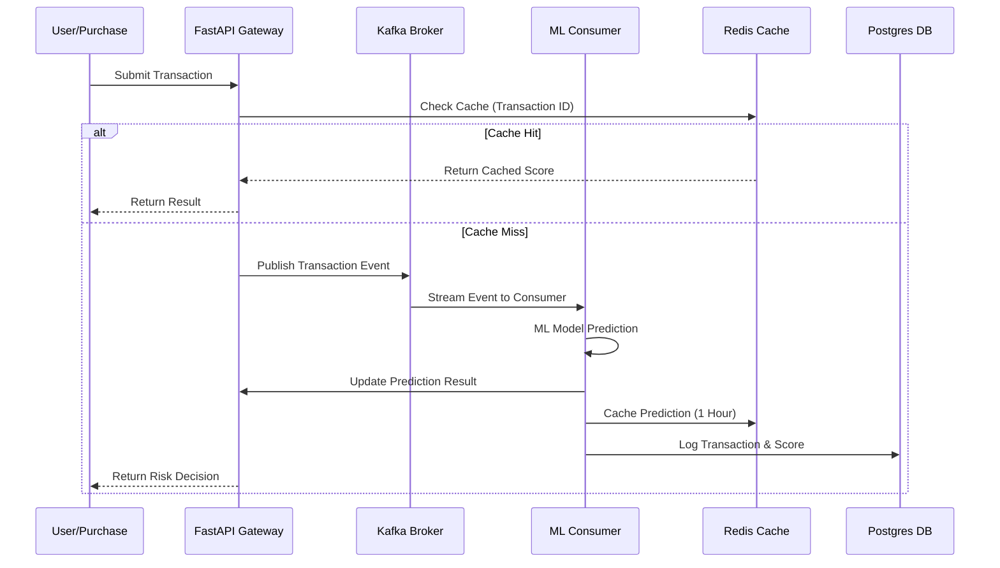
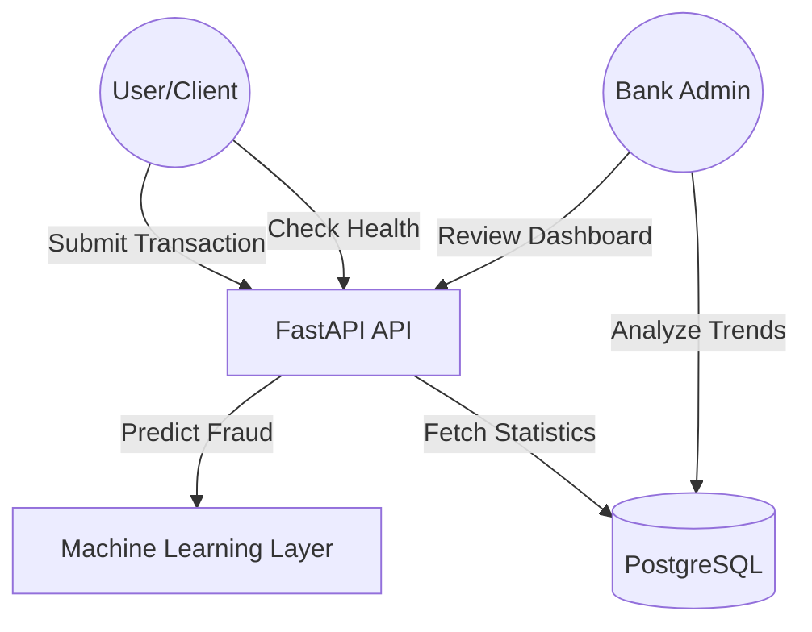
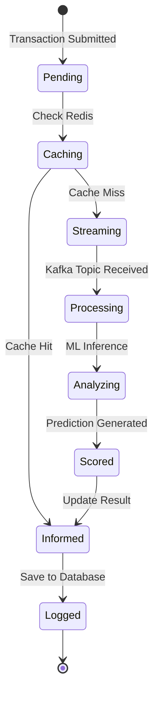

# Fraud Detection System

A high-performance, real-time transaction monitoring and fraud prevention platform leveraging Machine Learning, event streaming, and in-memory caching.

## Project Overview

This system is engineered to detect fraudulent financial transactions in milliseconds. It follows a microservices architecture designed for scalability and reliability, mimicking the systems used by major payment processors.

### Key Capabilities
* Real-time event processing using Apache Kafka.
* Low-latency risk scoring via XGBoost and LightGBM models.
* High-performance API gateway built with FastAPI.
* In-memory result caching using Redis for near-instant responses.
* Persistent transaction logging and analytics with PostgreSQL.

---

## System Architecture

### Application Structure

```text
fraud-detection-system/
├── data/                   # Dataset files (CSV)
├── notebooks/              # Research and model training notebooks
├── src/                    # Source code
│   ├── fastapi_service.py  # Main API Gateway
│   ├── kafka_producer.py   # Transaction stream simulator (Producer)
│   ├── kafka_consumer.py   # Real-time classifier (Consumer)
│   ├── redis_cache.py      # Caching layer logic
│   └── *.pkl               # Trained Machine Learning models
├── docker-compose.yml      # Infrastructure orchestration (Kafka, Redis, Postgres)
└── requirements.txt        # Python dependencies
```

### Sequence Diagram: Transaction Processing Flow

This diagram illustrates how a transaction moves from submission to final decision.



### Use Case Diagram



### State Diagram: Transaction Lifecycle



---

## Use Cases

### 1. Real-Time Credit Card Monitoring
Detecting stolen card usage by identifying anomalies in purchase behavior (e.g., unusual amounts, geographical shifts, or high-frequency transactions).

### 2. High-Volume Payment Gateways
Integrating with e-commerce platforms to provide instant risk scores during the checkout process to prevent chargebacks.

### 3. Regulatory Compliance & Auditing
Maintaining a permanent, auditable trail of all transactions and their associated risk scores to meet financial reporting requirements.

---

## Getting Started on Windows 11

### Prerequisites
* Docker Desktop installed and running.
* Python 3.9 or higher.

### Setup Instructions
1. Start infrastructure:
   ```powershell
   docker compose up -d
   ```
2. Setup environment:
   ```powershell
   python -m venv venv_win
   .\venv_win\Scripts\activate
   pip install -r requirements.txt
   ```
3. Run services (open separate terminals):
   ```powershell
   # API
   uvicorn src.fastapi_service:app --port 8001
   
   # Real-time Simulation
   python src/kafka_producer.py
   python src/kafka_consumer.py
   ```
